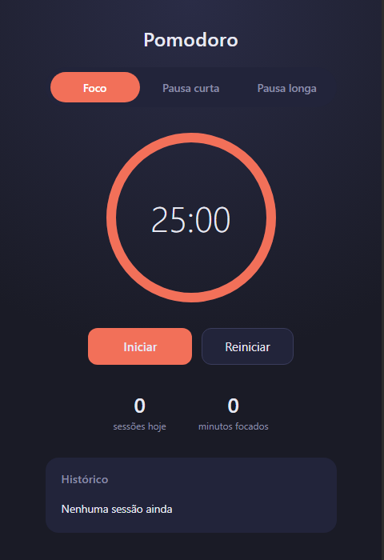
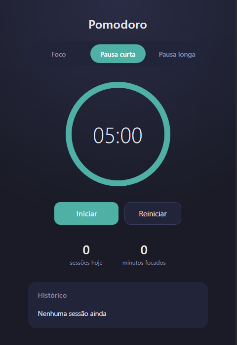
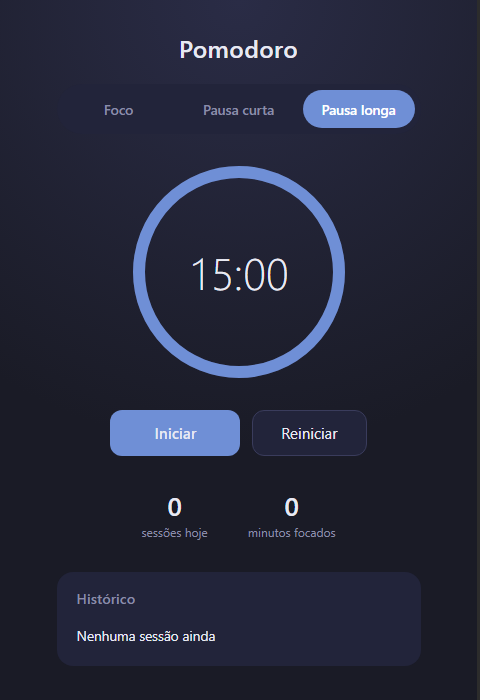
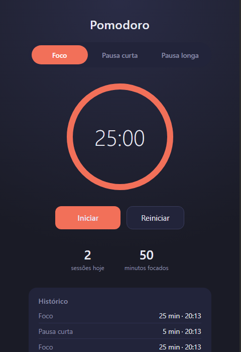

# Pomodoro Timer

Um timer Pomodoro simples e direto, feito com HTML, CSS e JavaScript puro (sem dependências).

<p align="center">
  
  
  
</p>

## Funcionalidades

- Três modos: **Foco** (25 min), **Pausa curta** (5 min) e **Pausa longa** (15 min)
- Anel de progresso animado mostrando o tempo restante
- Som de notificação ao concluir uma sessão
- Histórico das últimas sessões, salvo no `localStorage` do navegador
- Estatísticas do dia: número de sessões e minutos focados

Sessões concluídas ficam registradas no histórico, junto com as estatísticas do dia:

<p align="center">
  
</p>

## Como usar

Não é necessário instalar nada. Basta abrir o arquivo `index.html` no navegador:

```bash
# Windows
start index.html

# macOS
open index.html

# Linux
xdg-open index.html
```

Ou sirva a pasta com um servidor local simples, por exemplo:

```bash
python -m http.server 8000
```

e acesse `http://localhost:8000`.

## Estrutura do projeto

```
pomodoro-timer/
├── index.html   # Estrutura da página
├── style.css    # Estilos e tema
└── script.js    # Lógica do timer e persistência do histórico
```
