# Evolução visual — RIFTFALL

Cada versão = mesmas cenas/seed, para comparação direta. Gerado por `node tools/snapshot.mjs <rótulo>`.

## v02-integrated-all-modules  (2026-10-02T21:04 · 9bfad03)
> ⚠ 1 erro(s) de console: [01-overview] Failed to load resource: the server responded with a status of 404 (Not Found)

| Cena | v01-baseline-scaffold | v02-integrated-all-modules |
|---|---|---|
| 01-overview | 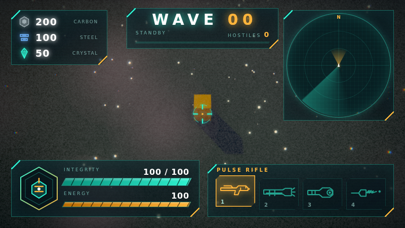 | 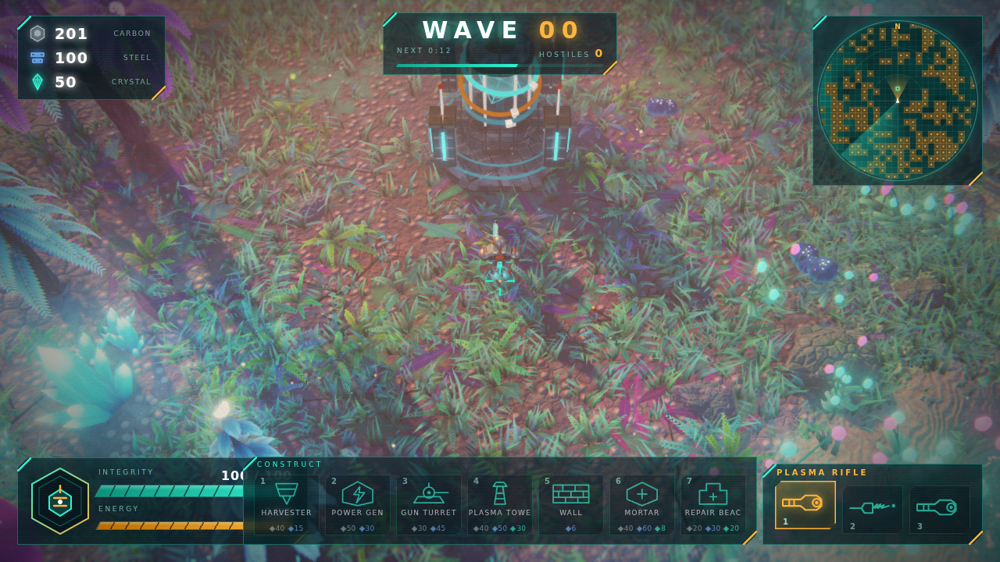 |
| 02-hero-closeup | 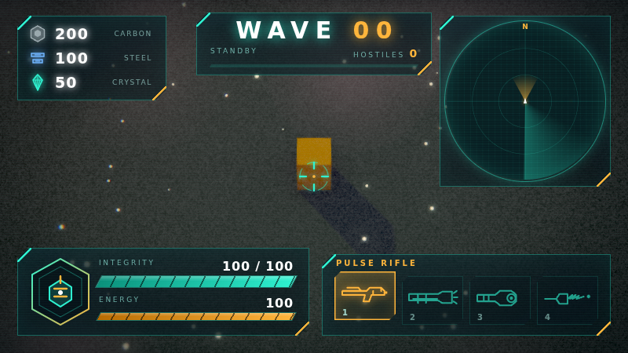 | 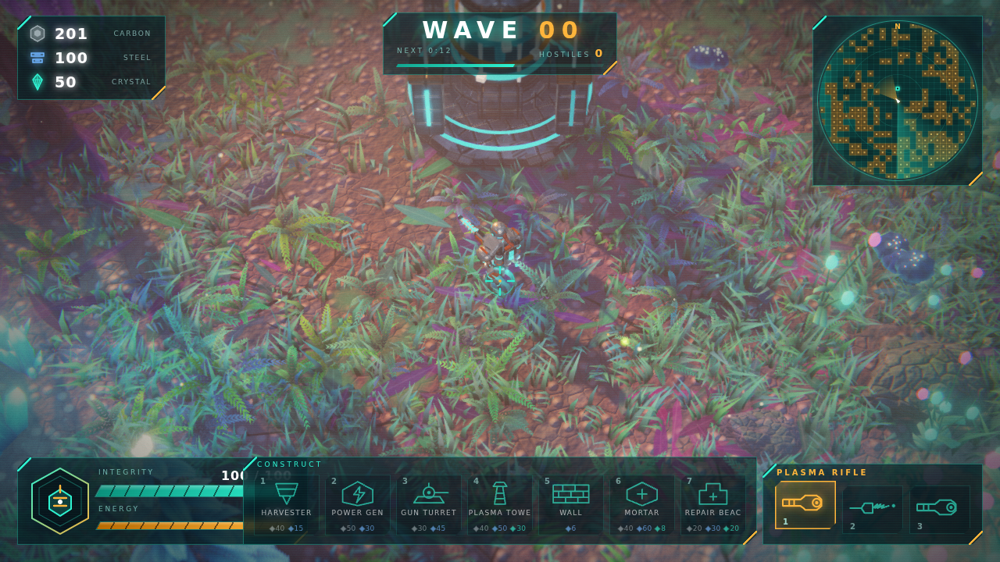 |
| 03-combat-horde | 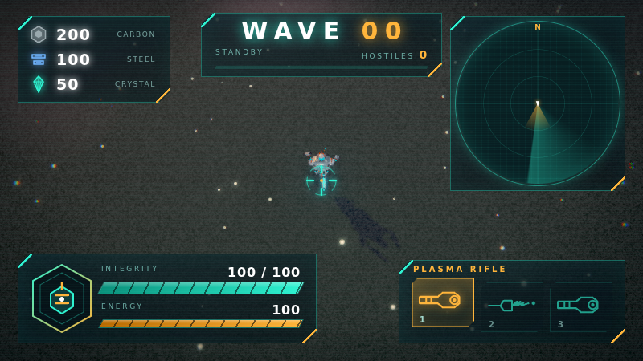 | 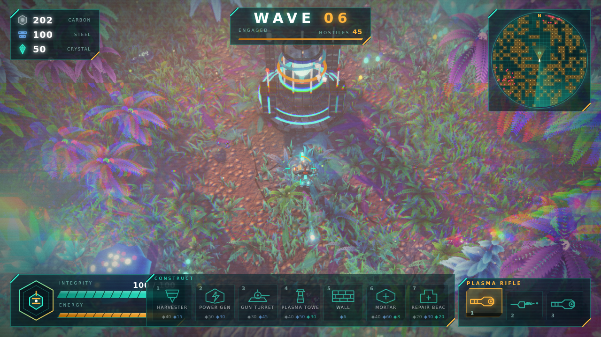 |
| 04-base | 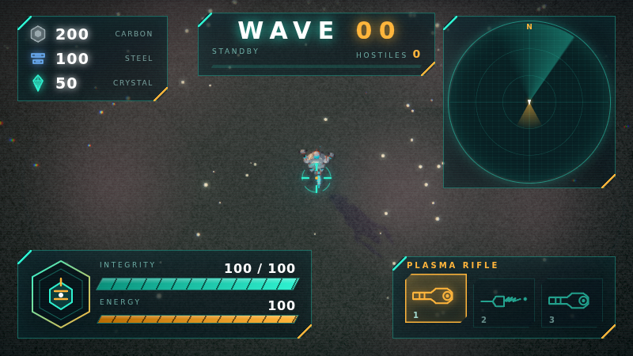 | 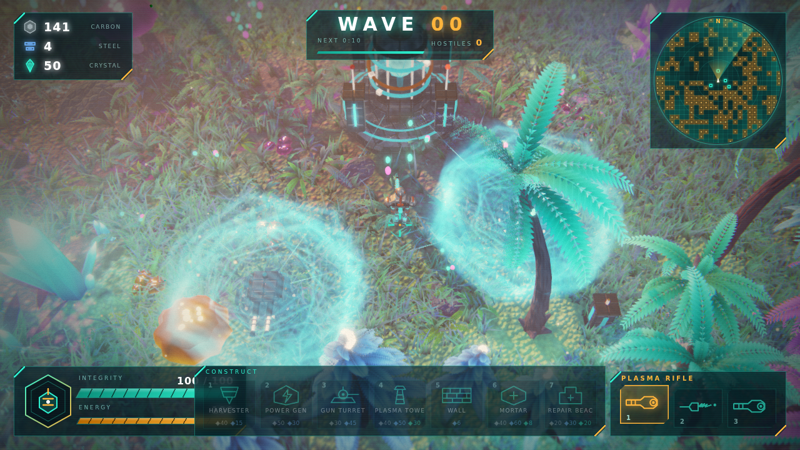 |
| 05-vfx-explosions |  | 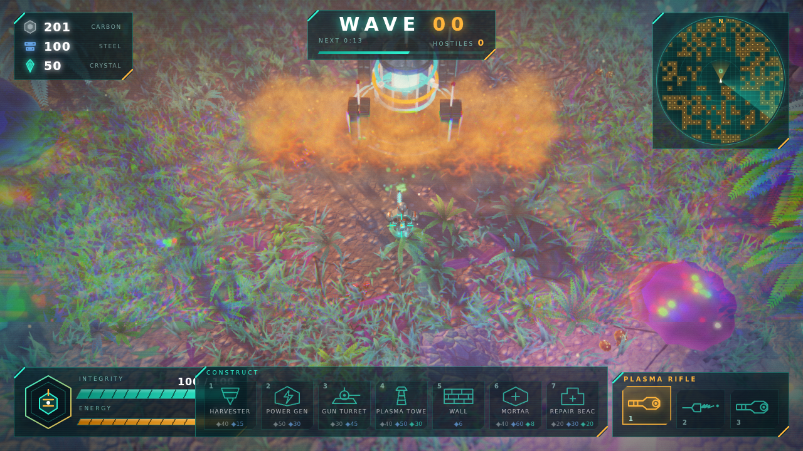 |
| 06-hud-ui | 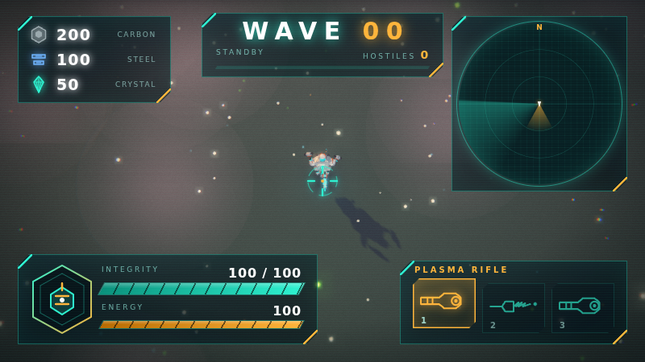 | 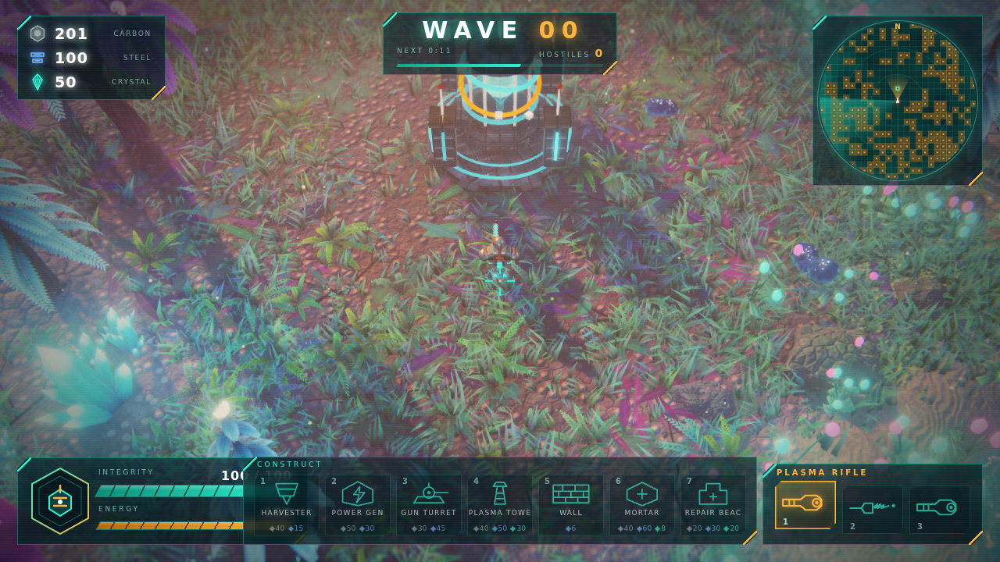 |
| 07-title | 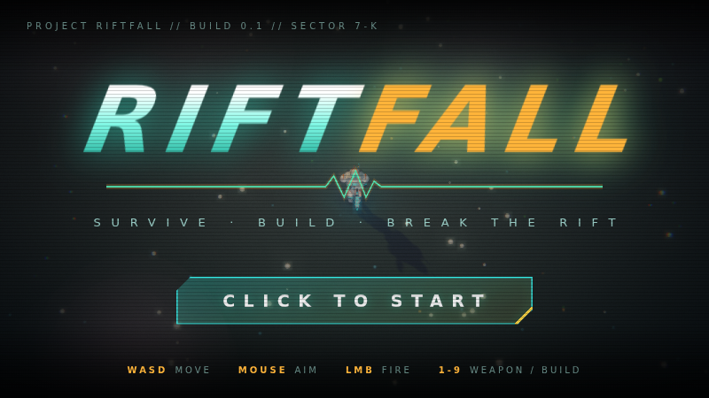 | 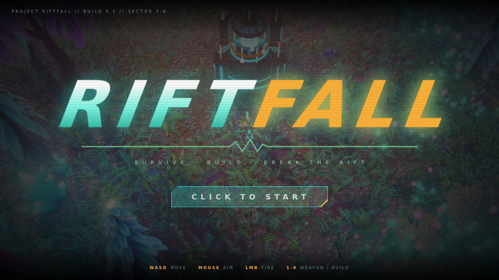 |

## v01-baseline-scaffold  (2026-10-02T20:10 · 23d4d5b)
> ⚠ 1 erro(s) de console: [01-overview] Failed to load resource: the server responded with a status of 404 (Not Found)

**01-overview**

**02-hero-closeup**

**03-combat-horde**

**04-base**

**05-vfx-explosions**

**06-hud-ui**

**07-title**

